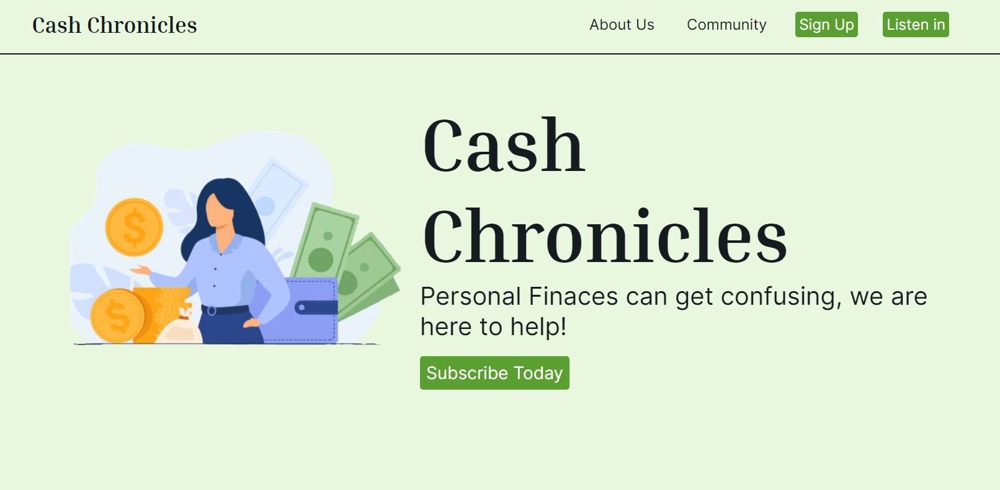
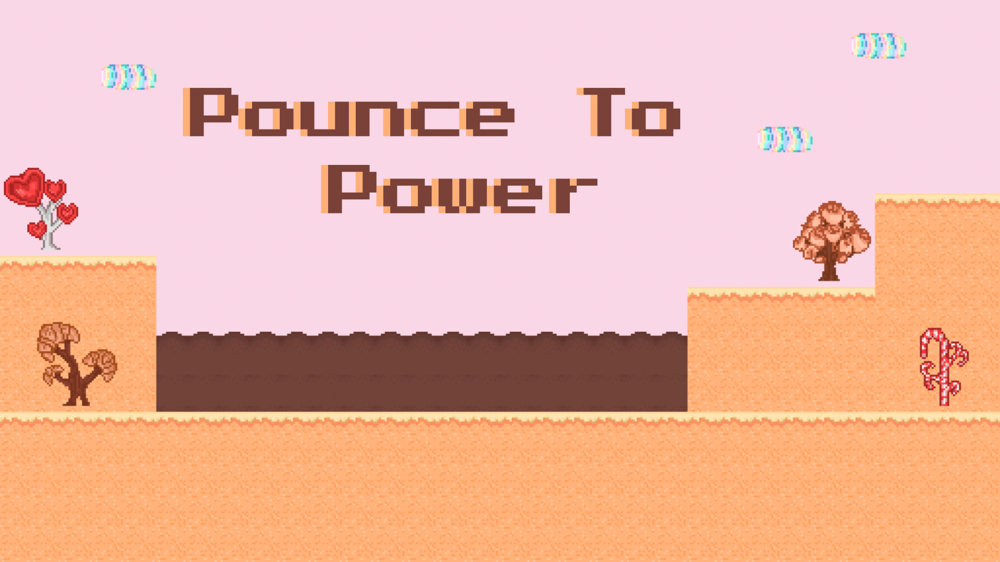

# Hi I'm Sophie, Welcome to my github! 👋

I'm a student working on earning my Bachelor of Applied Science in Software Development. 

- 🔭 I’m currently working on building projects to futher develop my programming skills
- 💻 I'm currently learning Javascript, PHP and SQL 

 

## View My Most Recent Project Here

### [Full Stack Podcast Website](https://github.com/smb78998/a_202420-CEN-4350)

### [Pounce to Power - GameJam JS 2024](https://github.com/smb78998/pounce-to-power)

 

<h3 align="left">Languages and Tools:</h3>

      

<!--
**smb78998/smb78998** is a ✨ _special_ ✨ repository because its `README.md` (this file) appears on your GitHub profile.

Here are some ideas to get you started:

- 🔭 I’m currently working on ...
- 🌱 I’m currently learning ...
- 👯 I’m looking to collaborate on ...
- 🤔 I’m looking for help with ...
- 💬 Ask me about ...
- 📫 How to reach me: ...
- 😄 Pronouns: ...
- ⚡ Fun fact: ...
-->
