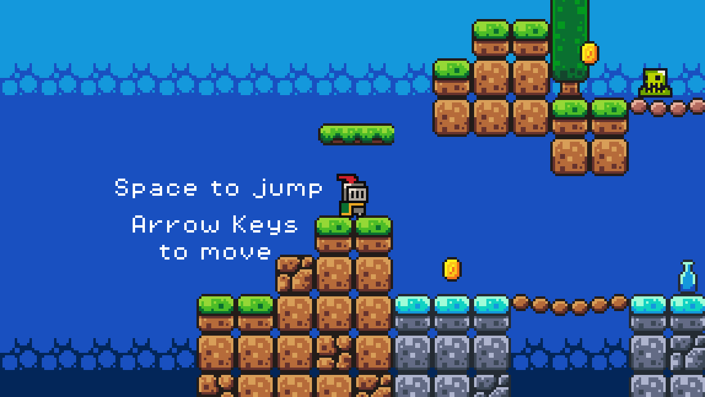
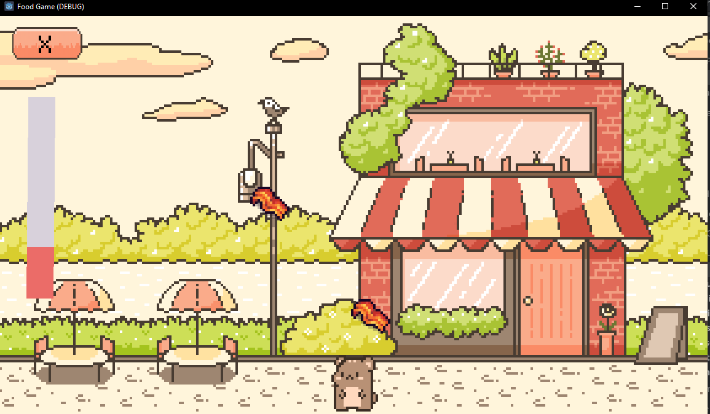

# Hi I'm Sophie, Welcome to my github! 👋

I'm a student working on earning my Bachelor of Applied Science in Software Development. 

- 🔭 I’m currently working on building projects to futher develop my programming skills
- 💻 I'm currently learning Web development and Godot
- 📊 Intered @ Siemens Energy as a Data Analyst

## Contact Information
- smb78998@gmail.com  
- <a href="https://www.linkedin.com/in/sophia-burgos-736a3a26b/">Visit Linkedin</a>

 

## View My Most Recent Project Here

### [Full Stack Podcast Website](https://github.com/smb78998/full-stack-podcast-website)

### [First Godot Game](https://github.com/smb78998/First-Godot-Game/tree/main)

### [Work in Progress Game](https://github.com/smb78998/food-game)

 

<!--
**smb78998/smb78998** is a ✨ _special_ ✨ repository because its `README.md` (this file) appears on your GitHub profile.

Here are some ideas to get you started:

- 🔭 I’m currently working on ...
- 🌱 I’m currently learning ...
- 👯 I’m looking to collaborate on ...
- 🤔 I’m looking for help with ...
- 💬 Ask me about ...
- 📫 How to reach me: ...
- 😄 Pronouns: ...
- ⚡ Fun fact: ...
-->
